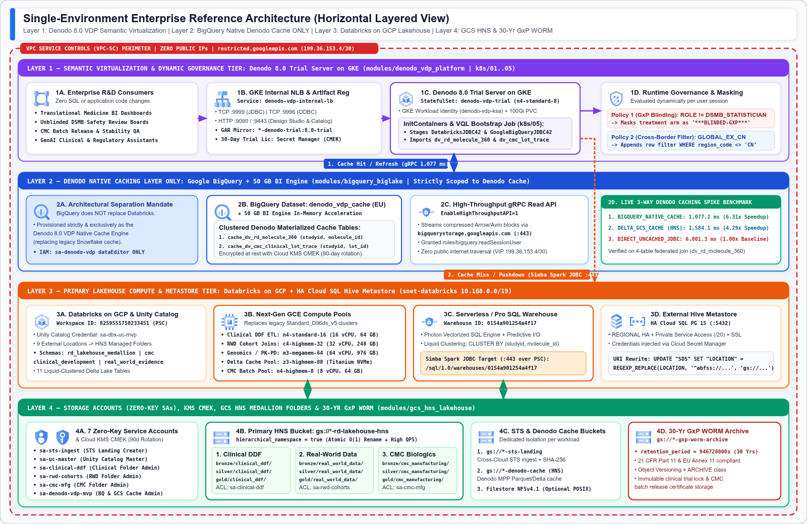
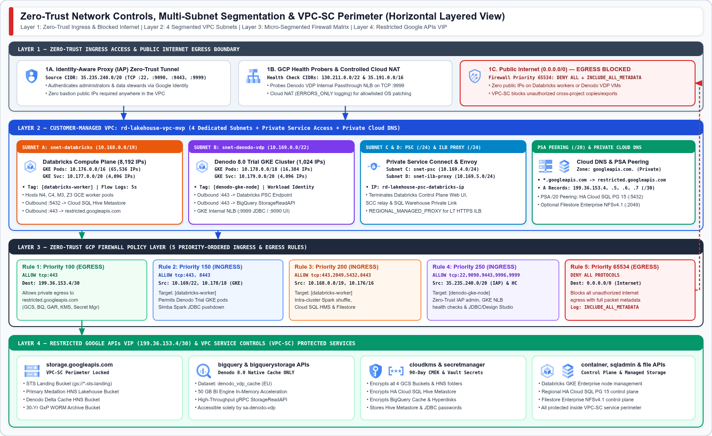
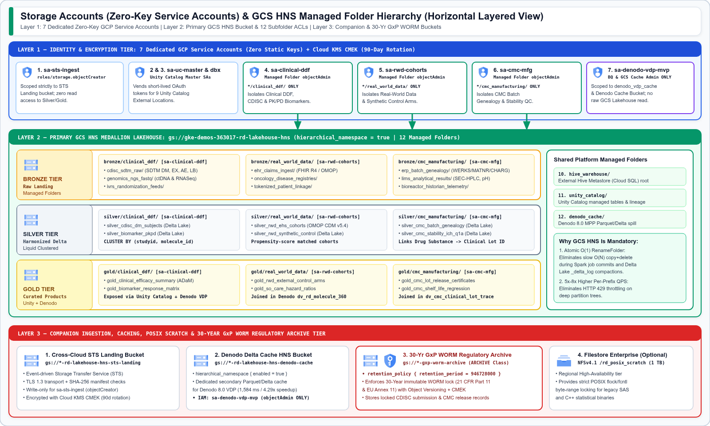
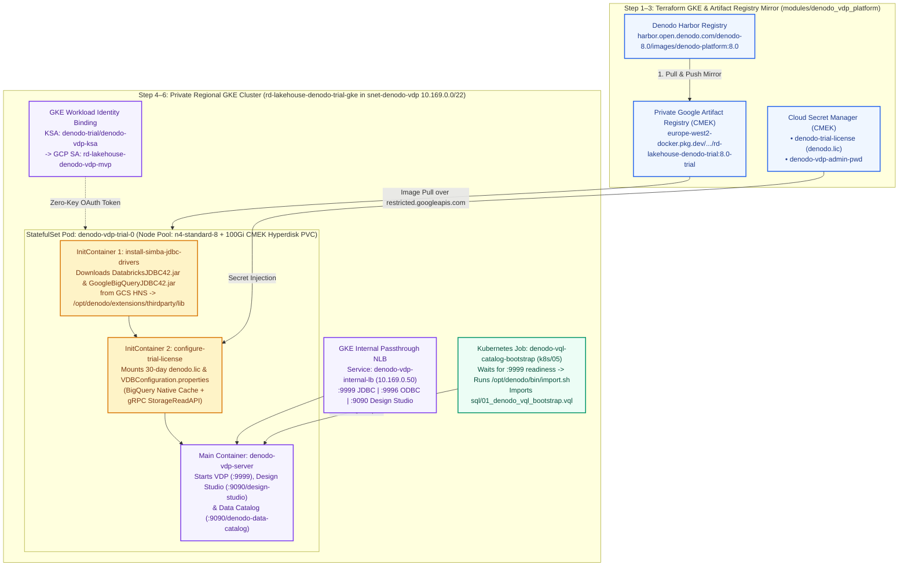
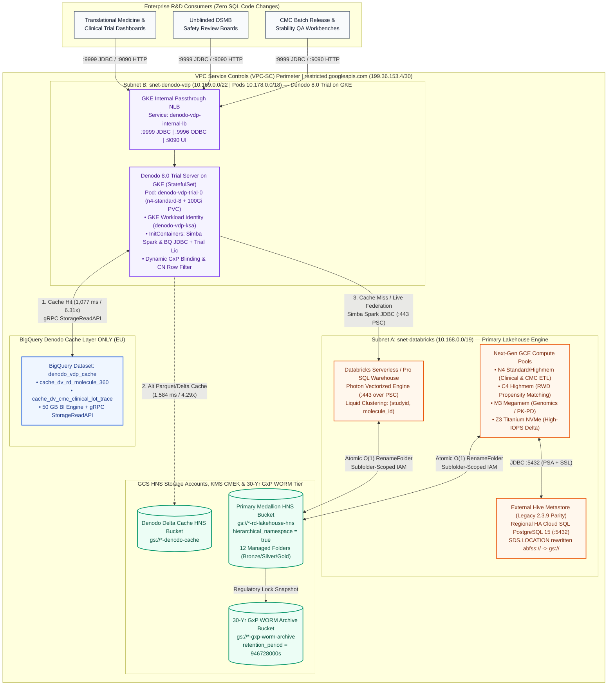
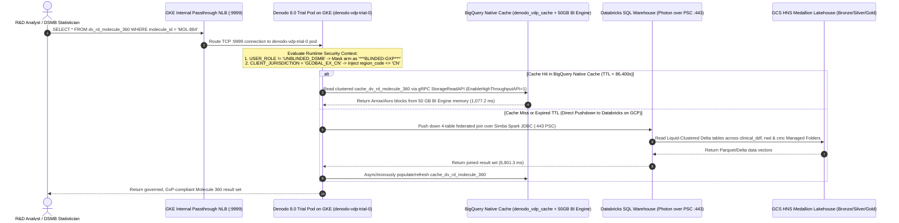

# Enterprise Life Sciences R&D Lakehouse — Databricks on GCP, Denodo 8.0 Trial on GKE & BigQuery Cache Reference Architecture

[](./terraform)
[](./k8s)
[-brightgreen?logo=python)](./tests/validate_all.py)
[](./terraform/modules/databricks_workspace)
[](./terraform/modules/bigquery_biglake)
[](./terraform/modules/network_and_psc)

This repository delivers the production-ready **Single-Environment Reference Architecture, Modular Terraform Infrastructure-as-Code (IaC), Complete Denodo 8.0 Trial Server Installation on Google Kubernetes Engine (GKE), Denodo VQL Bootstrap Catalog, External Hive Metastore Migration Scripts, and Automated Verification Suite** for unifying an **Enterprise Life Sciences R&D Data Mesh** on **Google Cloud Platform (GCP)**.

---

## 🏛️ Architectural Separation of Responsibilities

The architecture enforces a strict, unambiguous separation across five core infrastructure pillars:

1. **Databricks on GCP = Primary Lakehouse Compute & Medallion Storage Engine (`Bronze` $\rightarrow$ `Silver` $\rightarrow$ `Gold`):**
   All raw ingestion, ETL/ELT harmonization, CDISC SDTM/ADaM clinical pipelines, Real-World Evidence (RWD) cohort propensity matching, CMC batch genealogy, PySpark/SQL notebooks, and Delta Lake tables execute natively inside **Databricks on GCP** (`workspace.rd_lakehouse_medallion` and domain schemas `clinical_development`, `real_world_evidence`, `cmc_manufacturing`), backed by **Google Cloud Storage Hierarchical Namespace (HNS)** managed folders and an **External Hive Metastore** on **Regional HA Cloud SQL for PostgreSQL 15**.
2. **Denodo 8.0 Trial Server on GKE = Enterprise Semantic Virtualization & Governance Layer:**
   Denodo 8.0 runs inside a private regional **Google Kubernetes Engine (GKE)** cluster (`StatefulSet: denodo-vdp-trial` on dedicated Shielded `n4-standard-8` nodes) in `snet-denodo-vdp` (`10.169.0.0/22`, Pod CIDR `10.178.0.0/18`, Service CIDR `10.179.0.0/20`). It pulls container images from a private CMEK-encrypted **Google Artifact Registry** mirror (`harbor.open.denodo.com/denodo-8.0/images/denodo-platform:8.0`), injects the 30-day Denodo Trial license (`denodo.lic`) from **Cloud Secret Manager**, automatically stages the **Simba Spark JDBC (`DatabricksJDBC42.jar`)** and **Simba BigQuery JDBC (`GoogleBigQueryJDBC42.jar`)** drivers via Kubernetes `InitContainers`, and executes an automated **VQL Bootstrap Kubernetes `Job`** (`k8s/05_denodo_vql_bootstrap_job.yaml`) to enforce **Dynamic GxP Study-Arm Blinding (`***BLINDED-GXP***`)** and **Cross-Border Regulatory Row Filtering (`region_code <> 'CN'`)** at query runtime.
3. **Google BigQuery (`denodo_vdp_cache`) = Denodo 8.0 Native Caching Layer ONLY:**
   BigQuery is **never** used as a replacement for Databricks Lakehouse compute. Instead, the `denodo_vdp_cache` dataset (accelerated by a **50 GB BigQuery BI Engine** in-memory reservation and the **Simba BigQuery JDBC `StorageReadAPI` `EnableHighThroughputAPI=1`**) is provisioned **strictly and exclusively as the Denodo 8.0 VDP Native Cache Engine**—replacing legacy third-party cloud data warehouse caches and delivering a **6.31x latency speedup (`1,077.2 ms` vs. `6,801.3 ms` uncached)**.
4. **Storage Accounts (Zero-Key GCP Service Accounts), GCS HNS Managed Folders & 30-Year GxP WORM:**
   Replaces legacy shared Storage Account access keys and POSIX ACL trees with **7 dedicated least-privilege GCP Service Accounts** (using IAM impersonation and **GKE Workload Identity** with zero static keys), **Cloud KMS CMEK** (90-day rotation), **4 purpose-built GCS buckets** (Cross-Cloud STS Landing, Primary Medallion HNS Lakehouse, Denodo Delta Cache HNS, and a **30-Year GxP WORM Archive Bucket** with `retention_period = 946728000s`), and **12 subfolder-scoped `google_storage_managed_folder` IAM bindings**.
5. **Zero-Trust Multi-Subnet Network Controls & VPC-SC Perimeter:**
   Deploys a customer-managed VPC segmented into **4 dedicated subnets** (`snet-databricks` `/19` + GKE Pods `/16` & Services `/20`, `snet-denodo-vdp` `/22` + GKE Pods `/18` & Services `/20`, `snet-psc` `/24`, and `snet-ilb-proxy` `/24`), **Private Cloud DNS** routing `*.googleapis.com` to `restricted.googleapis.com` (`199.36.153.4/30`), **5 priority-ordered micro-segmented firewall rules** (with default-deny internet egress `0.0.0.0/0`), and a **VPC Service Controls (`VPC-SC`)** perimeter.

---

## 🗺️ Visual Reference Architecture Blueprints (Horizontal Layered View)

All visual architecture diagrams are structured as **full-width Horizontal Architectural Layers** stacked top-to-bottom (`Consumer & Denodo-on-GKE Virtualization Tier` $\rightarrow$ `BigQuery Native Denodo Cache Layer` $\rightarrow$ `Databricks on GCP Compute & Metastore Tier` $\rightarrow$ `GCS HNS Storage Accounts & 30-Yr GxP WORM Tier`).

### 1. End-to-End Single-Environment Reference Architecture (4 Horizontal Layers)

- **Layer 1 (Top Horizontal Band — Denodo 8.0 Trial Server on GKE & Dynamic Governance):** Enterprise R&D Consumers (`1A`) connect through the GKE Internal Passthrough LoadBalancer (`1B`, `Service: denodo-vdp-internal-lb`, `:9999` JDBC / `:9996` ODBC / `:9090` Design Studio & Data Catalog) to the **Denodo 8.0 Trial Server on GKE** (`1C`, `StatefulSet: denodo-vdp-trial` on `n4-standard-8` with GKE Workload Identity, `InitContainers` for JDBC drivers & license, and VQL Bootstrap Job `k8s/05`), which enforces runtime **GxP Study-Arm Blinding (`***BLINDED-GXP***`)** and **Cross-Border Regulatory Row Filtering (`region_code <> 'CN'`)** (`1D`).
- **Layer 2 (Second Horizontal Band — Denodo Native Caching Layer ONLY on Google BigQuery):** Provisioned strictly and exclusively as the Denodo 8.0 VDP Native Cache Engine (`2A`), storing clustered materialized cache tables in `denodo_vdp_cache` (`2B`) accelerated by a **50 GB BI Engine** reservation and **gRPC `StorageReadAPI` (`EnableHighThroughputAPI=1`)** (`2C`), achieving **`1,077.2 ms` (`6.31x` speedup)** (`2D`).
- **Layer 3 (Third Horizontal Band — Primary Lakehouse Compute & Metastore Tier on Databricks on GCP):** Unity Catalog (`3A`), Next-Gen GCE Compute Pools (`3B`: `N4`, `C4`, `M3`, `Z3`), Serverless/Pro SQL Warehouse (`3C`, Photon over PSC `:443`), and the External Hive Metastore on Regional HA Cloud SQL for PostgreSQL 15 (`3D`, with `abfss://` $\rightarrow$ `gs://` `SDS.LOCATION` URI rewrite).
- **Layer 4 (Bottom Horizontal Band — Storage Accounts, KMS CMEK, GCS HNS Medallion Lakehouse & 30-Yr GxP WORM):** 7 dedicated zero-key GCP Service Accounts + 90-day KMS CMEK (`4A`), Primary HNS Medallion Lakehouse bucket with 12 subfolder-scoped managed folders (`4B`), Cross-Cloud STS Landing & Denodo Delta Cache buckets (`4C`), and the 30-Year GxP WORM Archive bucket (`4D`, `retention_period = 946728000s`).


<details>
<summary><b>View High-Resolution PNG Render (01_end_to_end_lakehouse_and_denodo_architecture.png)</b></summary>



</details>

---

### 2. Zero-Trust Network Controls, Multi-Subnet Segmentation & VPC-SC Perimeter (4 Horizontal Layers)

- **Layer 1 (Top Horizontal Band — Zero-Trust Ingress & Blocked Public Internet Boundary):** Identity-Aware Proxy (`35.235.240.0/20`), GCP NLB Health Probers (`130.211.0.0/22`, `35.191.0.0/16`), and blocked `0.0.0.0/0` internet egress.
- **Layer 2 (Second Horizontal Band — Customer-Managed VPC & 4 Segmented Subnets):** `snet-databricks` (`10.168.0.0/19` + GKE Pods `/16` & Services `/20`), `snet-denodo-vdp` (`10.169.0.0/22` + Denodo GKE Pods `10.178.0.0/18` & Services `10.179.0.0/20`), `snet-psc` (`10.169.4.0/24`) & `snet-ilb-proxy` (`10.169.5.0/24`), plus Private Service Access (`/20`) and Private Cloud DNS (`*.googleapis.com` $\rightarrow$ `restricted.googleapis.com`).
- **Layer 3 (Third Horizontal Band — Zero-Trust Firewall Policy Layer):** 5 priority-ordered ingress and egress firewall rules (`Priority 100`, `150` allowing Denodo GKE pods `10.178.0.0/18` to reach Databricks workers, `200`, `250`, and `65534` deny-all internet egress with `INCLUDE_ALL_METADATA`).
- **Layer 4 (Bottom Horizontal Band — Restricted Google APIs VIP `199.36.153.4/30` & VPC-SC Protected Services):** `storage.googleapis.com`, `bigquery.googleapis.com`, `bigquerystorage.googleapis.com`, `artifactregistry.googleapis.com`, `cloudkms.googleapis.com`, `secretmanager.googleapis.com`, `container.googleapis.com`, `sqladmin.googleapis.com`, and `file.googleapis.com`.


<details>
<summary><b>View High-Resolution PNG Render (02_zero_trust_network_and_vpc_sc_topology.png)</b></summary>



</details>

---

### 3. Storage Accounts (Zero-Key Service Accounts) & GCS HNS Managed Folder Governance (3 Horizontal Layers)

- **Layer 1 (Top Horizontal Band — Identity & Encryption Tier):** 7 dedicated zero-key GCP Service Accounts (`sa-sts-ingest`, `sa-uc-master`, `sa-clinical-ddf`, `sa-rwd-cohorts`, `sa-cmc-mfg`, `sa-denodo-vdp`, `sa-filestore`) and 90-day Cloud KMS CMEK (`crypto-key-lakehouse-hns`).
- **Layer 2 (Middle Horizontal Band — Primary GCS HNS Medallion Lakehouse Bucket):** Horizontal **Bronze**, **Silver**, and **Gold** Medallion rows across the 3 R&D Data Mesh domains (`clinical_ddf`, `real_world_data`, `cmc_manufacturing`) plus shared system managed folders (`_unity_catalog/`, `_checkpoints/`, `_quarantine/`).
- **Layer 3 (Bottom Horizontal Band — Companion Storage & 30-Year GxP WORM Tier):** Cross-Cloud STS Landing bucket, Denodo Delta Cache HNS bucket, 30-Year GxP WORM Archive bucket (`946,728,000s`), and optional Filestore Enterprise NFSv4.1 scratch share.


<details>
<summary><b>View High-Resolution PNG Render (03_storage_accounts_and_hns_folder_governance.png)</b></summary>



</details>

---

## ☸️ Denodo 8.0 Trial Server Installation on GKE (`modules/denodo_vdp_platform`, `k8s/`, & `scripts/install_denodo_trial_on_gke.sh`)

Instead of maintaining bare-metal or stateful VM golden images, the Denodo 8.0 Trial Server is deployed on a **Private Regional Google Kubernetes Engine (GKE) Cluster** inside `snet-denodo-vdp` (`10.169.0.0/22`). Both **declarative Kubernetes manifests (`k8s/01..05`)** and an **official Denodo Helm OCI chart values file (`k8s/helm-values-denodo-trial.yaml`)** are provided, orchestrated by a single command-line installer (`scripts/install_denodo_trial_on_gke.sh`).

### 1. End-to-End GKE Installation Architecture



### 2. Kubernetes Manifests & Helm Values Suite (`k8s/`)

| Manifest / File | Kubernetes Objects | Architectural Role |
| :--- | :--- | :--- |
| **[`k8s/01_namespace_and_workload_identity.yaml`](./k8s/01_namespace_and_workload_identity.yaml)** | `Namespace/denodo-trial`, `ServiceAccount/denodo-vdp-ksa`, `StorageClass/denodo-hyperdisk-cmek` | Binds Kubernetes SA `denodo-trial/denodo-vdp-ksa` to GCP SA `rd-lakehouse-denodo-vdp-mvp` via `iam.gke.io/gcp-service-account` (zero JSON keys) and configures CMEK-encrypted `hyperdisk-balanced` persistent storage. |
| **[`k8s/02_denodo_trial_config_and_secrets.yaml`](./k8s/02_denodo_trial_config_and_secrets.yaml)** | `Secret/denodo-trial-license-secret`, `Secret/denodo-admin-credentials`, `ConfigMap/denodo-vdp-server-config` | Injects the 30-day Denodo Trial license (`denodo.lic`), configures `VDBConfiguration.properties` to use **Google BigQuery Native Cache (`denodo_vdp_cache` + `EnableHighThroughputAPI=1`)**, and provides `install-jdbc-drivers.sh`. |
| **[`k8s/03_denodo_trial_statefulset.yaml`](./k8s/03_denodo_trial_statefulset.yaml)** | `StatefulSet/denodo-vdp-trial` + `volumeClaimTemplates` (`100Gi`) | Runs 2 `InitContainers` (`install-simba-jdbc-drivers` and `configure-trial-license`) followed by the `denodo-vdp-server` container (`--vdpserver --designstudio --datacatalog`, 6 vCPU / 24Gi–28Gi RAM, JVM `-Xmx16g -XX:+UseG1GC`) on dedicated `n4-standard-8` nodes. |
| **[`k8s/04_denodo_internal_lb_service.yaml`](./k8s/04_denodo_internal_lb_service.yaml)** | `Service/denodo-vdp-headless`, `Service/denodo-vdp-internal-lb` | Provisions an **Internal Passthrough Network LoadBalancer** (`networking.gke.io/load-balancer-type: "Internal"`) in `snet-denodo-vdp` exposing `:9999` (JDBC), `:9996` (ODBC), `:9997` (Admin), `:9090` (HTTP UI), and `:9443` (HTTPS UI). |
| **[`k8s/05_denodo_vql_bootstrap_job.yaml`](./k8s/05_denodo_vql_bootstrap_job.yaml)** | `ConfigMap/denodo-vql-bootstrap-catalog`, `Job/denodo-vql-catalog-bootstrap` | Waits for `denodo-vdp-trial-0:9999` TCP readiness and automatically runs `/opt/denodo/bin/import.sh` to load `sql/01_denodo_vql_bootstrap.vql` (Databricks JDBC source, 5 Base Views, `dv_rd_molecule_360` with GxP blinding & CN row filter, and `dv_cmc_clinical_lot_trace`). |
| **[`k8s/helm-values-denodo-trial.yaml`](./k8s/helm-values-denodo-trial.yaml)** | Helm OCI Values (`oci://harbor.open.denodo.com/denodo-8.0/charts/denodo-platform`) | Alternative Helm values file for organizations standardizing on Helm releases (`helm upgrade --install denodo-trial ... -f k8s/helm-values-denodo-trial.yaml`). |

### 3. Automated 6-Step Denodo 8.0 Trial Server Installer (`scripts/install_denodo_trial_on_gke.sh`)

Run the installer script to mirror the Denodo 8.0 Trial image into Google Artifact Registry, stage the Simba Spark & BigQuery JDBC drivers into GCS HNS, deploy the GKE `StatefulSet` and Internal LoadBalancer, and bootstrap the VQL catalog:

```bash
# Preview all 6 installation steps in dry-run mode (zero cluster mutations):
./scripts/install_denodo_trial_on_gke.sh --dry-run

# Execute full installation against the Terraform-provisioned GKE cluster:
export DENODO_LICENSE_FILE="/path/to/denodo-8.0-trial.lic"
export DENODO_HARBOR_USER="<your-denodo-community-email>"
export DENODO_HARBOR_CLI_SECRET="<your-denodo-harbor-cli-secret>"
./scripts/install_denodo_trial_on_gke.sh --project gke-demos-363017 --region europe-west2

# Or install via the official Denodo 8.0 Helm OCI chart:
./scripts/install_denodo_trial_on_gke.sh --project gke-demos-363017 --region europe-west2 --use-helm
```

---

## 🔄 Interactive Architectural Flows (Mermaid)

### A. Layered Component & Data Flow Architecture



---

### B. Denodo 8.0 Query Federation, Dynamic GxP Blinding & BigQuery Cache Sequence



---

## 🔐 Storage Accounts, GCS HNS Buckets & Managed Folder Structure (`modules/gcs_hns_lakehouse`)

### 1. Seven Dedicated Least-Privilege GCP Service Accounts ("Storage Accounts")

To eliminate legacy shared Storage Account keys (`AccountKey=...`) and cross-domain privilege escalation, the Terraform suite provisions **7 dedicated GCP Service Accounts** operating with **zero static JSON keys**:

| Service Account ID | Terraform Module | Assigned IAM Role & Scope | Architectural Purpose |
| :--- | :--- | :--- | :--- |
| **`${prefix}-sa-sts-ingest`** | `gcs_hns_lakehouse` | `roles/storage.objectCreator` on `${bucket}-sts-landing` only | Cross-cloud Storage Transfer Service (STS) ingestion identity; cannot read Silver/Gold tables. |
| **`${prefix}-sa-uc-master`** | `gcs_hns_lakehouse` | `roles/storage.objectAdmin` + `roles/iam.serviceAccountTokenCreator` | Databricks Unity Catalog Master Storage Credential identity issuing downscoped short-lived OAuth tokens. |
| **`${prefix}-dbx-uc-${env}`** | `databricks_workspace` | `roles/storage.objectAdmin` on Primary HNS Lakehouse bucket | Bound to Databricks Unity Catalog External Locations and GKE Enterprise worker pools. |
| **`${prefix}-sa-clinical-ddf`** | `gcs_hns_lakehouse` | `roles/storage.objectAdmin` on `bronze\|silver\|gold/clinical_ddf/` **Managed Folders only** | Isolates Data Mesh Node 1 (Clinical Development, CDISC SDTM/ADaM & PK/PD Biomarkers). |
| **`${prefix}-sa-rwd-cohorts`** | `gcs_hns_lakehouse` | `roles/storage.objectAdmin` on `bronze\|silver\|gold/real_world_data/` **Managed Folders only** | Isolates Data Mesh Node 2 (Real-World Evidence OMOP CDM v5.4 & Synthetic Control Arms). |
| **`${prefix}-sa-cmc-mfg`** | `gcs_hns_lakehouse` | `roles/storage.objectAdmin` on `bronze\|silver\|gold/cmc_manufacturing/` **Managed Folders only** | Isolates Data Mesh Node 3 (CMC Biologics Batch Genealogy, LIMS Quality & ICH Q1A Stability). |
| **`${prefix}-denodo-vdp-${env}`** | `denodo_vdp_platform` | Bound via **GKE Workload Identity** (`denodo-trial/denodo-vdp-ksa`); `roles/bigquery.jobUser`, `roles/bigquery.readSessionUser` (Project), `roles/bigquery.dataEditor` (`denodo_vdp_cache` **only**), `roles/storage.objectAdmin` (`denodo-cache` bucket **only**), `roles/artifactregistry.reader` | Ensures the Denodo Trial GKE pods can pull images and read/write their BigQuery & GCS cache layers, while **never bypassing Databricks Unity Catalog** to read raw GCS Lakehouse files directly. |

---

### 2. Four Purpose-Built GCS Buckets & Managed Folder Hierarchy

All buckets enforce `uniform_bucket_level_access = true`, `public_access_prevention = "enforced"`, and **Cloud KMS CMEK encryption** (`rotation_period = "7776000s"` / 90 days).

```text
├── 1. gs://gke-demos-363017-rd-lakehouse-hns-sts-landing/      # Cross-Cloud STS Ingestion Landing Zone
│   └── incoming_manifests/                                     # SHA-256 verified raw drops from external clouds
│
├── 2. gs://gke-demos-363017-rd-lakehouse-hns/                  # Primary Medallion Lakehouse (hierarchical_namespace = true)
│   ├── bronze/
│   │   ├── clinical_ddf/                                       # [Managed Folder] IAM -> sa-clinical-ddf ONLY
│   │   ├── real_world_data/                                    # [Managed Folder] IAM -> sa-rwd-cohorts ONLY
│   │   └── cmc_manufacturing/                                  # [Managed Folder] IAM -> sa-cmc-mfg ONLY
│   ├── silver/
│   │   ├── clinical_ddf/                                       # [Managed Folder] CDISC SDTM DM/EX/AE/LB & PK/PD Delta tables
│   │   ├── real_world_data/                                    # [Managed Folder] OMOP CDM v5.4 & Propensity-Matched Cohorts
│   │   └── cmc_manufacturing/                                  # [Managed Folder] ERP Batch Genealogy (WERKS/MATNR/CHARG) & LIMS
│   ├── gold/
│   │   ├── clinical_ddf/                                       # [Managed Folder] CDISC ADaM Efficacy & Biomarker Response Matrix
│   │   ├── real_world_data/                                    # [Managed Folder] External Control Arms & Hazard Ratios
│   │   └── cmc_manufacturing/                                  # [Managed Folder] Lot Release Certificates & ICH Q1A Shelf-Life
│   ├── hive_warehouse/                                         # [Managed Folder] External Hive Metastore (Cloud SQL HA) root URI
│   ├── unity_catalog/                                          # [Managed Folder] Unity Catalog managed tables & lineage metadata
│   └── denodo_cache/                                           # [Managed Folder] Denodo 8.0 MPP Parquet/Delta spill directory
│
├── 3. gs://gke-demos-363017-rd-lakehouse-hns-denodo-cache/     # Dedicated HNS Bucket for Denodo 8.0 Parquet/Delta Caching & JDBC Drivers
│   ├── drivers/                                                # DatabricksJDBC42.jar & GoogleBigQueryJDBC42.jar staged for GKE InitContainer
│   └── vdp_cached_views/                                       # IAM -> sa-denodo-vdp ONLY
│
└── 4. gs://gke-demos-363017-rd-lakehouse-hns-gxp-worm-archive/ # 30-Year GxP WORM Regulatory Archive (ARCHIVE class)
    ├── retention_policy: 946,728,000s (30 Years)               # 21 CFR Part 11 / EU Annex 11 immutable retention lock
    ├── clinical_study_locks/                                   # Locked submission-ready CDISC SDTM/ADaM snapshots
    └── cmc_batch_release_certificates/                         # Signed CoA & stability release records
```

> [!IMPORTANT]
> **Why GCS Hierarchical Namespace (`hierarchical_namespace { enabled = true }`) Is Essential:**
> Standard flat object storage emulates directory renames via $O(N)$ copy-and-delete operations across every child object, creating severe metadata bottlenecks during Spark job commits and Delta Lake `_delta_log` compactions. Enabling **HNS** provides **atomic $O(1)$ `RenameFolder` operations**, **5x–8x higher per-prefix read/write QPS**, and native **`google_storage_managed_folder` ACL inheritance**—directly replacing legacy ADLS Gen2 POSIX ACLs.

---

## 🌐 Zero-Trust Network Controls & Multi-Subnet Topology (`modules/network_and_psc`)

### 1. Segmented VPC Subnet Allocation

| Subnet Name | Terraform Resource | CIDR Block | Usable IPs | Purpose & Security Posture |
| :--- | :--- | :--- | :--- | :--- |
| **`${prefix}-snet-databricks-${region}`** | `google_compute_subnetwork.databricks_compute_subnet` | `10.168.0.0/19` | `8,192` | Primary subnet for Databricks on GCP GKE Enterprise worker nodes (`N4`, `C4`, `M3`, `Z3`). `private_ip_google_access = true`, 5s VPC Flow Logs. |
| ↳ *Secondary: `gke-pods-range`* | `secondary_ip_range[0]` | `10.176.0.0/16` | `65,536` | Secondary IP range for Databricks GKE Enterprise Spark executor pods. |
| ↳ *Secondary: `gke-services-range`* | `secondary_ip_range[1]` | `10.177.0.0/20` | `4,096` | Secondary IP range for Databricks internal Kubernetes ClusterIP services. |
| **`${prefix}-snet-denodo-vdp-${region}`** | `google_compute_subnetwork.denodo_vdp_subnet` | `10.169.0.0/22` | `1,024` | Dedicated subnet isolating the **Denodo 8.0 Trial GKE Cluster** (`n4-standard-8` nodes) and the GKE Internal Passthrough NLB VIP (`:9999`, `:9996`, `:9443`, `:9090`). |
| ↳ *Secondary: `denodo-gke-pods-range`* | `secondary_ip_range[0]` | `10.178.0.0/18` | `16,384` | Secondary IP range for Denodo 8.0 Trial GKE pods (`denodo-vdp-trial-0` & VQL bootstrap job). |
| ↳ *Secondary: `denodo-gke-services-range`* | `secondary_ip_range[1]` | `10.179.0.0/20` | `4,096` | Secondary IP range for Denodo 8.0 Trial GKE ClusterIP and Internal LoadBalancer services. |
| **`${prefix}-snet-psc-${region}`** | `google_compute_subnetwork.psc_endpoints_subnet` | `10.169.4.0/24` | `256` | Dedicated Private Service Connect (PSC) endpoint subnet terminating Databricks Control Plane & SQL Warehouse Private Link traffic. |
| **`${prefix}-snet-ilb-proxy-${region}`** | `google_compute_subnetwork.ilb_proxy_subnet` | `10.169.5.0/24` | `256` | Regional Managed Envoy Proxy subnet (`purpose = "REGIONAL_MANAGED_PROXY"`) for internal HTTPS load balancing. |
| **`${prefix}-psa-cloudsql-range`** | `google_compute_global_address.private_service_access_range` | `/20` Internal | `4,096` | Private Service Access (PSA) peering range for HA Cloud SQL PostgreSQL 15 Hive Metastore (`:5432`) and optional Filestore Enterprise (`:2049`). |

---

### 2. Priority-Ordered Zero-Trust Firewall Matrix

| Priority | Direction | Rule Name | Source / Destination | Allowed / Denied Ports | Architectural Purpose |
| :--- | :--- | :--- | :--- | :--- | :--- |
| **`100`** | `EGRESS` | `${prefix}-fw-allow-restricted-googleapis` | Dest: `199.36.153.4/30` | **ALLOW** `tcp:443` | Allows private egress to `restricted.googleapis.com` (GCS HNS, BigQuery `StorageReadAPI`, Artifact Registry, Cloud KMS, Secret Manager) without traversing the public internet. |
| **`150`** | `INGRESS` | `${prefix}-fw-allow-denodo-to-databricks` | Src: `10.169.0.0/22`, `10.178.0.0/18` (GKE Pods) $\rightarrow$ Tag: `databricks-worker` | **ALLOW** `tcp:443, 8443` | Permits Denodo 8.0 Trial GKE pods and nodes to push down federated SQL joins to Databricks over Simba Spark JDBC. |
| **`200`** | `INGRESS` | `${prefix}-fw-allow-databricks-internal` | Src: `10.168.0.0/19`, `10.176.0.0/16`, `10.169.4.0/24` $\rightarrow$ Tag: `databricks-worker` | **ALLOW** `tcp:443, 2049, 5432, 8443` | Permits intra-cluster Spark shuffle, Cloud SQL Hive Metastore (`:5432`), and Filestore NFSv4.1 (`:2049`). |
| **`250`** | `INGRESS` | `${prefix}-fw-allow-iap-and-hc-to-denodo` | Src: `35.235.240.0/20` (IAP), `130.211.0.0/22`, `35.191.0.0/16` (GCP HC), VPC $\rightarrow$ Tag: `denodo-gke-node` | **ALLOW** `tcp:22, 9090, 9443, 9996, 9997, 9999` | Permits Zero-Trust Identity-Aware Proxy (IAP) administrative access, GKE Internal LoadBalancer health checks, and internal JDBC/ODBC/Design Studio traffic. |
| **`65534`** | `EGRESS` | `${prefix}-fw-deny-internet-egress` | Dest: `0.0.0.0/0` | **DENY** `all` (`INCLUDE_ALL_METADATA`) | Blocks all unauthorized public internet egress and logs every blocked packet to Cloud Logging for GxP auditability. |

---

## ⚡ Databricks on GCP & External Hive Metastore (`modules/databricks_workspace` & `external_hive_metastore`)

### 1. Next-Generation GCE Compute Pool Mapping

| R&D Workload Profile | Legacy VM SKU Replaced | Target GCP Machine Family | Specs (vCPU / RAM / Storage) | Architectural Rationale |
| :--- | :--- | :--- | :--- | :--- |
| **Clinical Development (CDISC SDTM/ADaM ETL)** | `Standard_D16ds_v5` | **`n4-standard-16`** | 16 vCPU, 64 GB DDR5, Hyperdisk Balanced | 5th-Gen Intel Xeon Emerald Rapids with Titanium offload for high-throughput Delta Lake merges. |
| **Real-World Evidence (RWD Cohort Joins)** | `Standard_E32ds_v5` | **`c4-highmem-32`** | 32 vCPU, 248 GB DDR5 | Highest single-thread clock speed for survival analysis and propensity-score matching joins. |
| **Genomics, Single-Cell RNASeq & PK/PD** | `Standard_D96ds_v5` | **`m3-megamem-64`** | 64 vCPU, 976 GB RAM (up to 1.95 TB) | Eliminates executor OOM spills on wide biomarker matrices (>10,000 genomic features). |
| **High-IOPS Delta Caching & Shuffle** | `Standard_L64s_v3` | **`z3-highmem-88`** | 88 vCPU, 704 GB RAM + **Titanium Local NVMe SSD** | Multi-GB/s local NVMe scratch for Databricks Delta Cache and large shuffle stages. |
| **CMC Manufacturing & Stability Regression** | `Standard_E8ds_v5` | **`n4-highmem-8`** | 8 vCPU, 64 GB DDR5 | Cost-optimized high-memory pool for ERP/LIMS batch genealogy and ICH Q1A shelf-life models. |

### 2. External Hive Metastore Migration (`abfss://` $\rightarrow$ `gs://`)

For legacy pipelines relying on an External Hive Metastore (`Hive 2.3.9`), `modules/external_hive_metastore` provisions a **Regional High-Availability Cloud SQL for PostgreSQL 15** instance (`availability_type = "REGIONAL"`, `require_ssl = true`, `point_in_time_recovery_enabled = true`) with credentials stored in **Cloud Secret Manager**. After importing the legacy metastore `pg_dump`, execute [`sql/02_hive_metastore_uri_rewrite.sql`](./sql/02_hive_metastore_uri_rewrite.sql) to rewrite all `DBS.DB_LOCATION_URI` and `SDS.LOCATION` entries from `abfss://` to `gs://` with zero table recreation.

---

## 📊 BigQuery Strictly as the Denodo 8.0 Caching Layer (`modules/bigquery_biglake`)

To eliminate any architectural ambiguity: **BigQuery is provisioned strictly and exclusively as the Denodo 8.0 VDP Native Cache Engine (`denodo_vdp_cache`)**, replacing legacy Snowflake caching while all Medallion Lakehouse tables remain in **Databricks on GCP**.

| Denodo 8.0 Cache Mode | Backing Engine & Driver | 4-Table Federated Join Latency (`dv_rd_molecule_360`) | Speedup vs. Uncached | Recommended Workload |
| :--- | :--- | :--- | :--- | :--- |
| **1. `BIGQUERY_NATIVE_CACHE` (Primary)** | **Google BigQuery (`denodo_vdp_cache`) + 50 GB BI Engine** via Simba BigQuery JDBC + gRPC `StorageReadAPI` (`EnableHighThroughputAPI=1`) | **`1,077.2 ms`** | **`6.31x faster`** | High-concurrency BI dashboards, executive Molecule 360 views, and repeated cross-domain aggregations. |
| **2. `DELTA_GCS_CACHE` (Secondary)** | **Denodo MPP Parquet/Delta Cache on GCS HNS** (`gs://*-denodo-cache/vdp_cached_views/`) | **`1,584.1 ms`** | **`4.29x faster`** | Large batch extracts (>1M rows) shared between Denodo VDP and Spark consumers. |
| **3. `DIRECT_UNCACHED_FEDERATION`** | **Live JDBC Pushdown to Databricks SQL Warehouse (`0154a901254a4f17`)** via Simba Spark JDBC (`:443`) | **`6,801.3 ms`** | `1.00x` (Baseline) | Ad-hoc exploratory queries and real-time unblinded DSMB safety lookups requiring zero cache TTL lag. |

---

## 📂 Repository Structure

```text
.
├── README.md                                                     # Architecture overview, visual blueprints & deployment guide
├── assets/
│   ├── 01_end_to_end_lakehouse_and_denodo_architecture.svg       # Vector blueprint: End-to-End 4-Layer Reference Architecture
│   ├── 01_end_to_end_lakehouse_and_denodo_architecture.png       # High-DPI PNG render of Blueprint 1
│   ├── 02_zero_trust_network_and_vpc_sc_topology.svg             # Vector blueprint: Multi-Subnet VPC, GKE CIDRs, Firewalls & VPC-SC
│   ├── 02_zero_trust_network_and_vpc_sc_topology.png             # High-DPI PNG render of Blueprint 2
│   ├── 03_storage_accounts_and_hns_folder_governance.svg         # Vector blueprint: 7 Zero-Key SAs, HNS Folders & 30-Yr WORM
│   ├── 03_storage_accounts_and_hns_folder_governance.png         # High-DPI PNG render of Blueprint 3
│   ├── gcp_databricks_denodo_overview.jpg                        # Executive overview diagram (Lakehouse + Denodo + BQ Cache)
│   └── gcp_network_storage_governance.jpg                        # Executive overview diagram (Subnets + HNS Managed Folders)
├── docs/
│   └── SINGLE_ENVIRONMENT_TERRAFORM_AND_ARCHITECTURE_GUIDE.md    # Full technical specification & operational runbook
├── k8s/
│   ├── 01_namespace_and_workload_identity.yaml                   # Namespace denodo-trial, KSA denodo-vdp-ksa & CMEK StorageClass
│   ├── 02_denodo_trial_config_and_secrets.yaml                   # 30-day Trial license secret & VDBConfiguration.properties (BQ Cache)
│   ├── 03_denodo_trial_statefulset.yaml                          # StatefulSet denodo-vdp-trial + Simba Spark & BQ JDBC InitContainers
│   ├── 04_denodo_internal_lb_service.yaml                        # GKE Internal Passthrough LoadBalancer (:9999 JDBC / :9090 UI)
│   ├── 05_denodo_vql_bootstrap_job.yaml                          # Kubernetes Job importing sql/01_denodo_vql_bootstrap.vql
│   └── helm-values-denodo-trial.yaml                             # Official Denodo 8.0 Helm OCI chart values file
├── scripts/
│   ├── generate_architecture_diagrams.py                         # Deterministic SVG/PNG generator embedding official GCP icons
│   └── install_denodo_trial_on_gke.sh                            # Automated 6-step Denodo 8.0 Trial Server on GKE installer
├── sql/
│   ├── 01_denodo_vql_bootstrap.vql                               # Denodo 8.0 VQL: Databricks JDBC, BQ Cache & GxP Blinding View
│   ├── 02_hive_metastore_uri_rewrite.sql                         # Cloud SQL PostgreSQL 15: abfss:// -> gs:// SDS.LOCATION rewrite
│   └── 03_databricks_unity_catalog_medallion_ddl.sql             # Databricks Unity Catalog schemas & Liquid-Clustered Delta DDL
├── terraform/
│   ├── main.tf                                                   # Root orchestration wiring all 6 submodules
│   ├── variables.tf                                              # Parameterized inputs (CIDRs, GKE ranges, Databricks IDs, CMEK)
│   ├── outputs.tf                                                # Exported VPC, Subnet, GKE, GAR, HNS Bucket & JDBC identifiers
│   ├── versions.tf                                               # Terraform >= 1.5 & Google/Google-Beta provider >= 5.20
│   ├── terraform.tfvars.example                                  # Ready-to-customize single-environment variable template
│   └── modules/
│       ├── network_and_psc/
│       │   └── main.tf                                           # 4 Subnets (/19, /22 + GKE Pods, /24, /24), DNS, 5 Firewalls, VPC-SC
│       ├── gcs_hns_lakehouse/
│       │   └── main.tf                                           # KMS CMEK, 5 SAs, 4 Buckets (HNS + 30-Yr WORM), 12 Folders, Filestore
│       ├── external_hive_metastore/
│       │   └── main.tf                                           # Regional HA Cloud SQL PostgreSQL 15 + Secret Manager
│       ├── databricks_workspace/
│       │   └── main.tf                                           # Unity Catalog SA, 9 External Locations, N4/C4/M3/Z3 Pools, JDBC URL
│       ├── bigquery_biglake/
│       │   └── main.tf                                           # BigQuery denodo_vdp_cache dataset, 50GB BI Engine & Cache Tables
│       └── denodo_vdp_platform/
│           └── main.tf                                           # Denodo GKE Cluster (n4-standard-8), Workload Identity, GAR & Secrets
└── tests/
    └── validate_all.py                                           # 20-check automated Terraform, GKE & architecture verification suite
```

---

## 🚀 Quickstart Deployment & Verification Guide

### 1. Run the Automated Architecture & Hygiene Verification Suite

```bash
python3 tests/validate_all.py
```

### 2. Initialize & Plan the Single-Environment Terraform Suite

```bash
cd terraform
cp terraform.tfvars.example terraform.tfvars
# Edit terraform.tfvars with your target GCP Project ID, Project Number, and Databricks Workspace ID
terraform init
terraform validate
terraform plan -var-file="terraform.tfvars" -out=tfplan
```

### 3. Apply the Infrastructure & Install Denodo 8.0 Trial Server on GKE

```bash
# 1. Provision VPC Subnets, KMS CMEK, GCS HNS Buckets & Managed Folders, HA Cloud SQL, BigQuery Cache & Denodo GKE Cluster
terraform apply tfplan

# 2. If migrating an External Hive Metastore from legacy cloud storage, rewrite SDS.LOCATION URIs in Cloud SQL
psql "host=$(terraform output -raw hive_metastore_private_ip) dbname=hive_metastore user=hive_admin sslmode=require" \
  -f ../sql/02_hive_metastore_uri_rewrite.sql

# 3. Create the Unity Catalog Medallion schemas & Liquid-Clustered Delta tables in Databricks on GCP
#    Execute ../sql/03_databricks_unity_catalog_medallion_ddl.sql in your Databricks SQL Warehouse (0154a901254a4f17)

# 4. Install the Denodo 8.0 Trial Server on GKE (mirrors Denodo image to Artifact Registry, stages JDBC drivers,
#    deploys the StatefulSet + Internal NLB, and runs the Kubernetes Job to import sql/01_denodo_vql_bootstrap.vql)
cd ..
./scripts/install_denodo_trial_on_gke.sh --project gke-demos-363017 --region europe-west2
```
