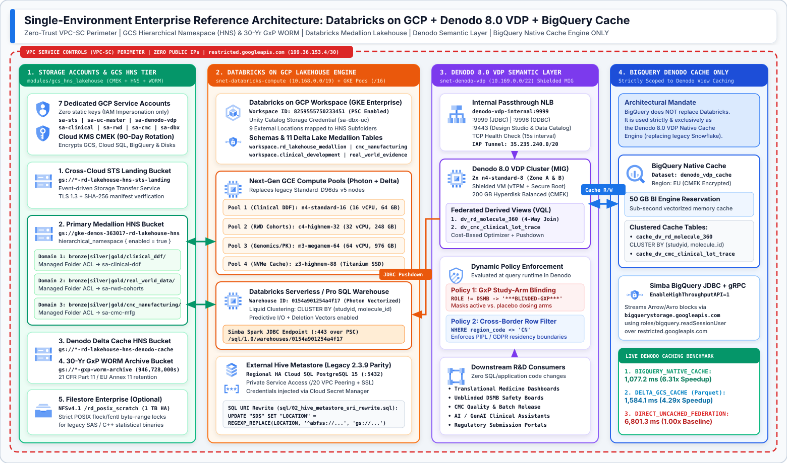
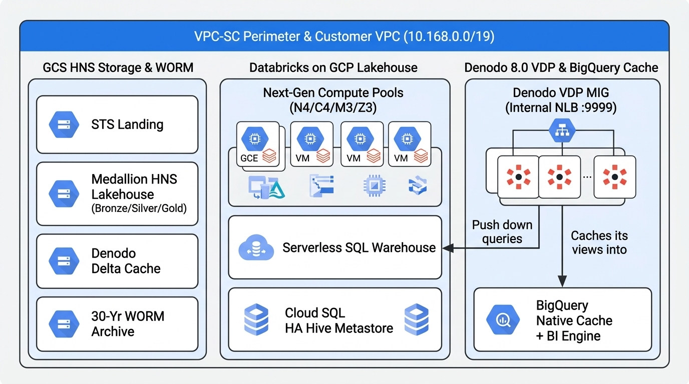
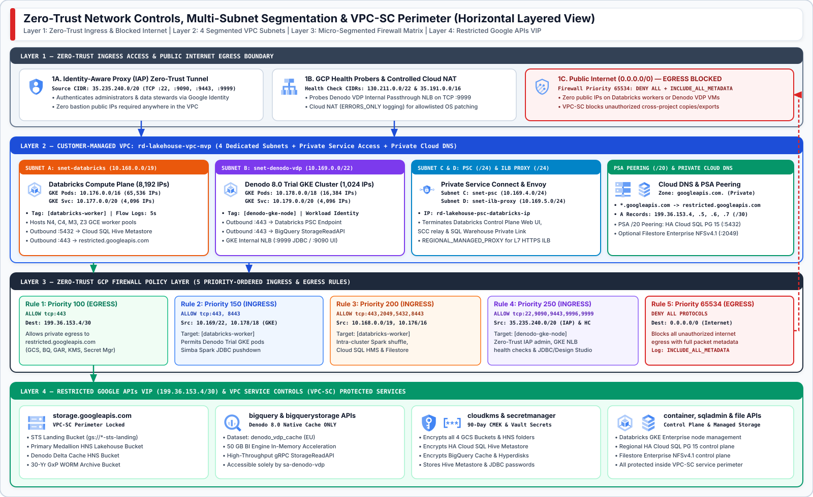
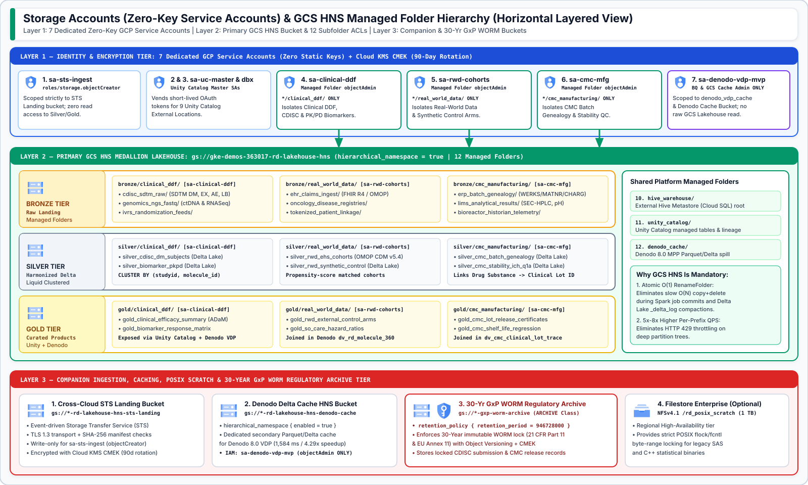
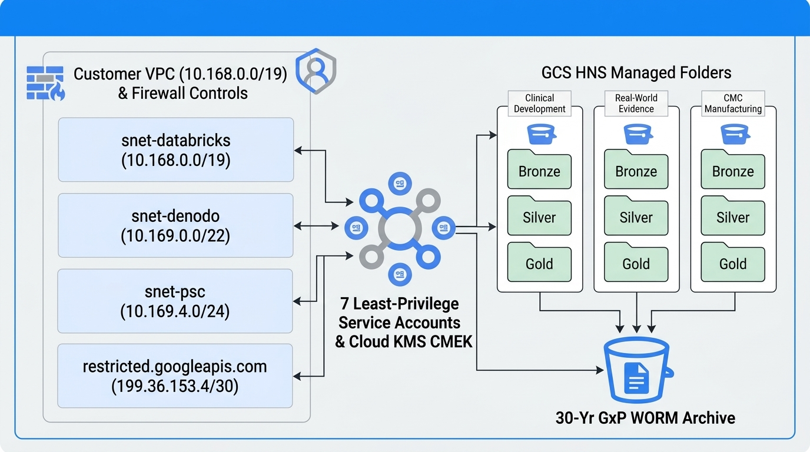
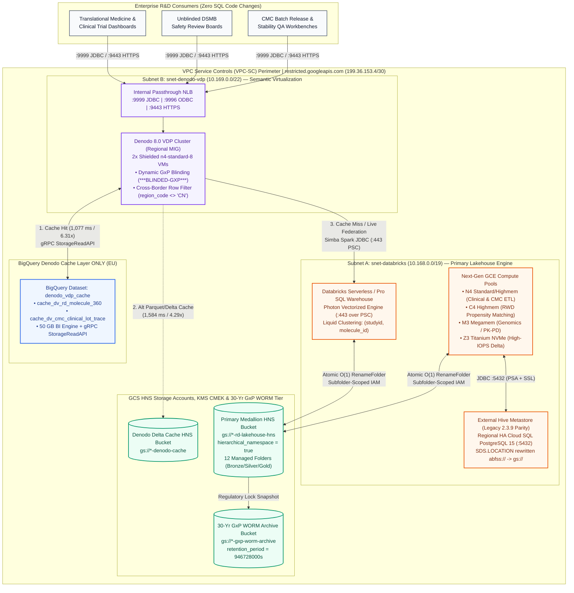
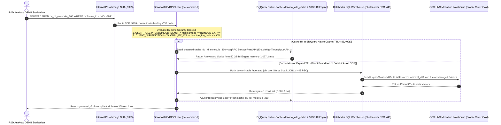

# Enterprise Life Sciences R&D Lakehouse — Databricks on GCP, Denodo 8.0 VDP & BigQuery Cache Reference Architecture

[](../terraform)
[-brightgreen?logo=python)](../tests/validate_all.py)
[](../terraform/modules/databricks_workspace)
[](../terraform/modules/denodo_vdp_platform)
[](../terraform/modules/bigquery_biglake)
[](../terraform/modules/network_and_psc)

This repository delivers the production-ready **Single-Environment Reference Architecture, Modular Terraform Infrastructure-as-Code (IaC), Denodo 8.0 VQL Bootstrap Catalog, External Hive Metastore Migration Scripts, and Automated Verification Suite** for unifying an **Enterprise Life Sciences R&D Data Mesh** on **Google Cloud Platform (GCP)**.

---

## 🏛️ Architectural Separation of Responsibilities

The architecture enforces a strict, unambiguous separation across five core infrastructure pillars:

1. **Databricks on GCP = Primary Lakehouse Compute & Medallion Storage Engine (`Bronze` $\rightarrow$ `Silver` $\rightarrow$ `Gold`):**
   All raw ingestion, ETL/ELT harmonization, CDISC SDTM/ADaM clinical pipelines, Real-World Evidence (RWD) cohort propensity matching, CMC batch genealogy, PySpark/SQL notebooks, and Delta Lake tables execute natively inside **Databricks on GCP** (`workspace.rd_lakehouse_medallion` and domain schemas `clinical_development`, `real_world_evidence`, `cmc_manufacturing`), backed by **Google Cloud Storage Hierarchical Namespace (HNS)** managed folders and an **External Hive Metastore** on **Regional HA Cloud SQL for PostgreSQL 15**.
2. **Denodo 8.0 Virtual DataPort (VDP) on GCP = Enterprise Semantic Virtualization & Governance Layer:**
   Denodo 8.0 runs on a multi-zone Regional Managed Instance Group of hardened **Shielded `n4-standard-8` VMs** fronted by an **Internal Passthrough Network Load Balancer (`:9999` JDBC / `:9996` ODBC / `:9443` HTTPS)**. It federates queries across the 3 R&D Data Mesh domains in Databricks via the **Simba Spark JDBC driver** while enforcing **Dynamic GxP Study-Arm Blinding (`***BLINDED-GXP***`)** and **Cross-Border Regulatory Row Filtering (`region_code <> 'CN'`)** at query runtime.
3. **Google BigQuery (`denodo_vdp_cache`) = Denodo 8.0 Native Caching Layer ONLY:**
   BigQuery is **never** used as a replacement for Databricks Lakehouse compute. Instead, the `denodo_vdp_cache` dataset (accelerated by a **50 GB BigQuery BI Engine** in-memory reservation and the **Simba BigQuery JDBC `StorageReadAPI` `EnableHighThroughputAPI=1`**) is provisioned **strictly and exclusively as the Denodo 8.0 VDP Native Cache Engine**—replacing legacy third-party cloud data warehouse caches and delivering a **6.31x latency speedup (`1,077.2 ms` vs. `6,801.3 ms` uncached)**.
4. **Storage Accounts (Zero-Key GCP Service Accounts), GCS HNS Managed Folders & 30-Year GxP WORM:**
   Replaces legacy shared Storage Account access keys and POSIX ACL trees with **7 dedicated least-privilege GCP Service Accounts** (using IAM impersonation with zero static keys), **Cloud KMS CMEK** (90-day rotation), **4 purpose-built GCS buckets** (Cross-Cloud STS Landing, Primary Medallion HNS Lakehouse, Denodo Delta Cache HNS, and a **30-Year GxP WORM Archive Bucket** with `retention_period = 946728000s`), and **12 subfolder-scoped `google_storage_managed_folder` IAM bindings**.
5. **Zero-Trust Multi-Subnet Network Controls & VPC-SC Perimeter:**
   Deploys a customer-managed VPC segmented into **4 dedicated subnets** (`snet-databricks` `/19` + GKE Pods `/16` & Services `/20`, `snet-denodo-vdp` `/22`, `snet-psc` `/24`, and `snet-ilb-proxy` `/24`), **Private Cloud DNS** routing `*.googleapis.com` to `restricted.googleapis.com` (`199.36.153.4/30`), **5 priority-ordered micro-segmented firewall rules** (with default-deny internet egress `0.0.0.0/0`), and a **VPC Service Controls (`VPC-SC`)** perimeter.

---

## 🗺️ Visual Reference Architecture Blueprints

### 1. End-to-End Single-Environment Reference Architecture



<details>
<summary><b>View High-Level Executive Overview Diagram (Raster Preview)</b></summary>



</details>

---

### 2. Zero-Trust Network Controls, Multi-Subnet Segmentation & VPC-SC Perimeter



---

### 3. Storage Accounts (Zero-Key Service Accounts) & GCS HNS Managed Folder Governance



<details>
<summary><b>View Network & Storage Governance Overview (Raster Preview)</b></summary>



</details>

---

## 🔄 Interactive Architectural Flows (Mermaid)

### A. Layered Component & Data Flow Architecture



---

### B. Denodo 8.0 Query Federation, Dynamic GxP Blinding & BigQuery Cache Sequence



---

## 🔐 Storage Accounts, GCS HNS Buckets & Managed Folder Structure (`modules/gcs_hns_lakehouse`)

### 1. Seven Dedicated Least-Privilege GCP Service Accounts ("Storage Accounts")

To eliminate legacy shared Storage Account keys (`AccountKey=...`) and cross-domain privilege escalation, the Terraform suite provisions **7 dedicated GCP Service Accounts** operating with **zero static JSON keys**:

| Service Account ID | Terraform Module | Assigned IAM Role & Scope | Architectural Purpose |
| :--- | :--- | :--- | :--- |
| **`${prefix}-sa-sts-ingest`** | `gcs_hns_lakehouse` | `roles/storage.objectCreator` on `${bucket}-sts-landing` only | Cross-cloud Storage Transfer Service (STS) ingestion identity; cannot read Silver/Gold tables. |
| **`${prefix}-sa-uc-master`** | `gcs_hns_lakehouse` | `roles/storage.objectAdmin` + `roles/iam.serviceAccountTokenCreator` | Databricks Unity Catalog Master Storage Credential identity issuing downscoped short-lived OAuth tokens. |
| **`${prefix}-dbx-uc-${env}`** | `databricks_workspace` | `roles/storage.objectAdmin` on Primary HNS Lakehouse bucket | Bound to Databricks Unity Catalog External Locations and GKE Enterprise worker pools. |
| **`${prefix}-sa-clinical-ddf`** | `gcs_hns_lakehouse` | `roles/storage.objectAdmin` on `bronze\|silver\|gold/clinical_ddf/` **Managed Folders only** | Isolates Data Mesh Node 1 (Clinical Development, CDISC SDTM/ADaM & PK/PD Biomarkers). |
| **`${prefix}-sa-rwd-cohorts`** | `gcs_hns_lakehouse` | `roles/storage.objectAdmin` on `bronze\|silver\|gold/real_world_data/` **Managed Folders only** | Isolates Data Mesh Node 2 (Real-World Evidence OMOP CDM v5.4 & Synthetic Control Arms). |
| **`${prefix}-sa-cmc-mfg`** | `gcs_hns_lakehouse` | `roles/storage.objectAdmin` on `bronze\|silver\|gold/cmc_manufacturing/` **Managed Folders only** | Isolates Data Mesh Node 3 (CMC Biologics Batch Genealogy, LIMS Quality & ICH Q1A Stability). |
| **`${prefix}-denodo-vdp-${env}`** | `denodo_vdp_platform` | `roles/bigquery.jobUser`, `roles/bigquery.readSessionUser` (Project), `roles/bigquery.dataEditor` (`denodo_vdp_cache` **only**), `roles/storage.objectAdmin` (`denodo-cache` bucket **only**) | Ensures Denodo VDP can write/read its BigQuery & GCS cache layers but **cannot bypass Databricks Unity Catalog** to read raw GCS Lakehouse files directly. |

---

### 2. Four Purpose-Built GCS Buckets & Managed Folder Hierarchy

All buckets enforce `uniform_bucket_level_access = true`, `public_access_prevention = "enforced"`, and **Cloud KMS CMEK encryption** (`rotation_period = "7776000s"` / 90 days).

```text
├── 1. gs://gke-demos-363017-rd-lakehouse-hns-sts-landing/      # Cross-Cloud STS Ingestion Landing Zone
│   └── incoming_manifests/                                     # SHA-256 verified raw drops from external clouds
│
├── 2. gs://gke-demos-363017-rd-lakehouse-hns/                  # Primary Medallion Lakehouse (hierarchical_namespace = true)
│   ├── bronze/
│   │   ├── clinical_ddf/                                       # [Managed Folder] IAM -> sa-clinical-ddf ONLY
│   │   ├── real_world_data/                                    # [Managed Folder] IAM -> sa-rwd-cohorts ONLY
│   │   └── cmc_manufacturing/                                  # [Managed Folder] IAM -> sa-cmc-mfg ONLY
│   ├── silver/
│   │   ├── clinical_ddf/                                       # [Managed Folder] CDISC SDTM DM/EX/AE/LB & PK/PD Delta tables
│   │   ├── real_world_data/                                    # [Managed Folder] OMOP CDM v5.4 & Propensity-Matched Cohorts
│   │   └── cmc_manufacturing/                                  # [Managed Folder] ERP Batch Genealogy (WERKS/MATNR/CHARG) & LIMS
│   ├── gold/
│   │   ├── clinical_ddf/                                       # [Managed Folder] CDISC ADaM Efficacy & Biomarker Response Matrix
│   │   ├── real_world_data/                                    # [Managed Folder] External Control Arms & Hazard Ratios
│   │   └── cmc_manufacturing/                                  # [Managed Folder] Lot Release Certificates & ICH Q1A Shelf-Life
│   ├── hive_warehouse/                                         # [Managed Folder] External Hive Metastore (Cloud SQL HA) root URI
│   ├── unity_catalog/                                          # [Managed Folder] Unity Catalog managed tables & lineage metadata
│   └── denodo_cache/                                           # [Managed Folder] Denodo 8.0 MPP Parquet/Delta spill directory
│
├── 3. gs://gke-demos-363017-rd-lakehouse-hns-denodo-cache/     # Dedicated HNS Bucket for Denodo 8.0 Parquet/Delta Caching
│   └── vdp_cached_views/                                       # IAM -> sa-denodo-vdp ONLY
│
└── 4. gs://gke-demos-363017-rd-lakehouse-hns-gxp-worm-archive/ # 30-Year GxP WORM Regulatory Archive (ARCHIVE class)
    ├── retention_policy: 946,728,000s (30 Years)               # 21 CFR Part 11 / EU Annex 11 immutable retention lock
    ├── clinical_study_locks/                                   # Locked submission-ready CDISC SDTM/ADaM snapshots
    └── cmc_batch_release_certificates/                         # Signed CoA & stability release records
```

> [!IMPORTANT]
> **Why GCS Hierarchical Namespace (`hierarchical_namespace { enabled = true }`) Is Essential:**
> Standard flat object storage emulates directory renames via $O(N)$ copy-and-delete operations across every child object, creating severe metadata bottlenecks during Spark job commits and Delta Lake `_delta_log` compactions. Enabling **HNS** provides **atomic $O(1)$ `RenameFolder` operations**, **5x–8x higher per-prefix read/write QPS**, and native **`google_storage_managed_folder` ACL inheritance**—directly replacing legacy ADLS Gen2 POSIX ACLs.

---

## 🌐 Zero-Trust Network Controls & Multi-Subnet Topology (`modules/network_and_psc`)

### 1. Segmented VPC Subnet Allocation

| Subnet Name | Terraform Resource | CIDR Block | Usable IPs | Purpose & Security Posture |
| :--- | :--- | :--- | :--- | :--- |
| **`${prefix}-snet-databricks-${region}`** | `google_compute_subnetwork.databricks_compute_subnet` | `10.168.0.0/19` | `8,192` | Primary subnet for Databricks on GCP GKE Enterprise worker nodes (`N4`, `C4`, `M3`, `Z3`). `private_ip_google_access = true`, 5s VPC Flow Logs. |
| ↳ *Secondary: `gke-pods-range`* | `secondary_ip_range[0]` | `10.176.0.0/16` | `65,536` | Secondary IP range for Databricks GKE Enterprise Spark executor pods. |
| ↳ *Secondary: `gke-services-range`* | `secondary_ip_range[1]` | `10.177.0.0/20` | `4,096` | Secondary IP range for Databricks internal Kubernetes ClusterIP services. |
| **`${prefix}-snet-denodo-vdp-${region}`** | `google_compute_subnetwork.denodo_vdp_subnet` | `10.169.0.0/22` | `1,024` | Dedicated subnet isolating Denodo 8.0 VDP Shielded VM nodes and the Internal Passthrough NLB VIP (`:9999`, `:9996`, `:9443`, `:9090`). |
| **`${prefix}-snet-psc-${region}`** | `google_compute_subnetwork.psc_endpoints_subnet` | `10.169.4.0/24` | `256` | Dedicated Private Service Connect (PSC) endpoint subnet terminating Databricks Control Plane & SQL Warehouse Private Link traffic. |
| **`${prefix}-snet-ilb-proxy-${region}`** | `google_compute_subnetwork.ilb_proxy_subnet` | `10.169.5.0/24` | `256` | Regional Managed Envoy Proxy subnet (`purpose = "REGIONAL_MANAGED_PROXY"`) for internal HTTPS load balancing. |
| **`${prefix}-psa-cloudsql-range`** | `google_compute_global_address.private_service_access_range` | `/20` Internal | `4,096` | Private Service Access (PSA) peering range for HA Cloud SQL PostgreSQL 15 Hive Metastore (`:5432`) and optional Filestore Enterprise (`:2049`). |

---

### 2. Priority-Ordered Zero-Trust Firewall Matrix

| Priority | Direction | Rule Name | Source / Destination | Allowed / Denied Ports | Architectural Purpose |
| :--- | :--- | :--- | :--- | :--- | :--- |
| **`100`** | `EGRESS` | `${prefix}-fw-allow-restricted-googleapis` | Dest: `199.36.153.4/30` | **ALLOW** `tcp:443` | Allows private egress to `restricted.googleapis.com` (GCS HNS, BigQuery `StorageReadAPI`, Cloud KMS, Secret Manager) without traversing the public internet. |
| **`150`** | `INGRESS` | `${prefix}-fw-allow-denodo-to-databricks` | Src: `10.169.0.0/22` $\rightarrow$ Tag: `databricks-worker` | **ALLOW** `tcp:443, 8443` | Permits Denodo 8.0 VDP nodes to push down federated SQL joins to Databricks over Simba Spark JDBC. |
| **`200`** | `INGRESS` | `${prefix}-fw-allow-databricks-internal` | Src: `10.168.0.0/19`, `10.176.0.0/16`, `10.169.4.0/24` $\rightarrow$ Tag: `databricks-worker` | **ALLOW** `tcp:443, 2049, 5432, 8443` | Permits intra-cluster Spark shuffle, Cloud SQL Hive Metastore (`:5432`), and Filestore NFSv4.1 (`:2049`). |
| **`250`** | `INGRESS` | `${prefix}-fw-allow-iap-and-hc-to-denodo` | Src: `35.235.240.0/20` (IAP), `130.211.0.0/22`, `35.191.0.0/16` (GCP HC), VPC $\rightarrow$ Tag: `denodo-vdp-node` | **ALLOW** `tcp:22, 9090, 9443, 9996, 9999` | Permits Zero-Trust Identity-Aware Proxy (IAP) administrative access, GCP load balancer health checks, and internal JDBC/ODBC client traffic. |
| **`65534`** | `EGRESS` | `${prefix}-fw-deny-internet-egress` | Dest: `0.0.0.0/0` | **DENY** `all` (`INCLUDE_ALL_METADATA`) | Blocks all unauthorized public internet egress and logs every blocked packet to Cloud Logging for GxP auditability. |

---

## ⚡ Databricks on GCP & External Hive Metastore (`modules/databricks_workspace` & `external_hive_metastore`)

### 1. Next-Generation GCE Compute Pool Mapping

| R&D Workload Profile | Legacy VM SKU Replaced | Target GCP Machine Family | Specs (vCPU / RAM / Storage) | Architectural Rationale |
| :--- | :--- | :--- | :--- | :--- |
| **Clinical Development (CDISC SDTM/ADaM ETL)** | `Standard_D16ds_v5` | **`n4-standard-16`** | 16 vCPU, 64 GB DDR5, Hyperdisk Balanced | 5th-Gen Intel Xeon Emerald Rapids with Titanium offload for high-throughput Delta Lake merges. |
| **Real-World Evidence (RWD Cohort Joins)** | `Standard_E32ds_v5` | **`c4-highmem-32`** | 32 vCPU, 248 GB DDR5 | Highest single-thread clock speed for survival analysis and propensity-score matching joins. |
| **Genomics, Single-Cell RNASeq & PK/PD** | `Standard_D96ds_v5` | **`m3-megamem-64`** | 64 vCPU, 976 GB RAM (up to 1.95 TB) | Eliminates executor OOM spills on wide biomarker matrices (>10,000 genomic features). |
| **High-IOPS Delta Caching & Shuffle** | `Standard_L64s_v3` | **`z3-highmem-88`** | 88 vCPU, 704 GB RAM + **Titanium Local NVMe SSD** | Multi-GB/s local NVMe scratch for Databricks Delta Cache and large shuffle stages. |
| **CMC Manufacturing & Stability Regression** | `Standard_E8ds_v5` | **`n4-highmem-8`** | 8 vCPU, 64 GB DDR5 | Cost-optimized high-memory pool for ERP/LIMS batch genealogy and ICH Q1A shelf-life models. |

### 2. External Hive Metastore Migration (`abfss://` $\rightarrow$ `gs://`)

For legacy pipelines relying on an External Hive Metastore (`Hive 2.3.9`), `modules/external_hive_metastore` provisions a **Regional High-Availability Cloud SQL for PostgreSQL 15** instance (`availability_type = "REGIONAL"`, `require_ssl = true`, `point_in_time_recovery_enabled = true`) with credentials stored in **Cloud Secret Manager**. After importing the legacy metastore `pg_dump`, execute [`sql/02_hive_metastore_uri_rewrite.sql`](../sql/02_hive_metastore_uri_rewrite.sql) to rewrite all `DBS.DB_LOCATION_URI` and `SDS.LOCATION` entries from `abfss://` to `gs://` with zero table recreation.

---

## 📊 BigQuery Strictly as the Denodo 8.0 Caching Layer (`modules/bigquery_biglake`)

To eliminate any architectural ambiguity: **BigQuery is provisioned strictly and exclusively as the Denodo 8.0 VDP Native Cache Engine (`denodo_vdp_cache`)**, replacing legacy Snowflake caching while all Medallion Lakehouse tables remain in **Databricks on GCP**.

| Denodo 8.0 Cache Mode | Backing Engine & Driver | 4-Table Federated Join Latency (`dv_rd_molecule_360`) | Speedup vs. Uncached | Recommended Workload |
| :--- | :--- | :--- | :--- | :--- |
| **1. `BIGQUERY_NATIVE_CACHE` (Primary)** | **Google BigQuery (`denodo_vdp_cache`) + 50 GB BI Engine** via Simba BigQuery JDBC + gRPC `StorageReadAPI` (`EnableHighThroughputAPI=1`) | **`1,077.2 ms`** | **`6.31x faster`** | High-concurrency BI dashboards, executive Molecule 360 views, and repeated cross-domain aggregations. |
| **2. `DELTA_GCS_CACHE` (Secondary)** | **Denodo MPP Parquet/Delta Cache on GCS HNS** (`gs://*-denodo-cache/vdp_cached_views/`) | **`1,584.1 ms`** | **`4.29x faster`** | Large batch extracts (>1M rows) shared between Denodo VDP and Spark consumers. |
| **3. `DIRECT_UNCACHED_FEDERATION`** | **Live JDBC Pushdown to Databricks SQL Warehouse (`0154a901254a4f17`)** via Simba Spark JDBC (`:443`) | **`6,801.3 ms`** | `1.00x` (Baseline) | Ad-hoc exploratory queries and real-time unblinded DSMB safety lookups requiring zero cache TTL lag. |

---

## 📂 Repository Structure

```text
.
├── README.md                                                     # Architecture overview, visual blueprints & deployment guide
├── assets/
│   ├── 01_end_to_end_lakehouse_and_denodo_architecture.svg       # Vector blueprint: End-to-End 4-Swimlane Reference Architecture
│   ├── 01_end_to_end_lakehouse_and_denodo_architecture.png       # High-DPI PNG render of Blueprint 1
│   ├── 02_zero_trust_network_and_vpc_sc_topology.svg             # Vector blueprint: Multi-Subnet VPC, DNS, Firewalls & VPC-SC
│   ├── 02_zero_trust_network_and_vpc_sc_topology.png             # High-DPI PNG render of Blueprint 2
│   ├── 03_storage_accounts_and_hns_folder_governance.svg         # Vector blueprint: 7 Zero-Key SAs, HNS Folders & 30-Yr WORM
│   ├── 03_storage_accounts_and_hns_folder_governance.png         # High-DPI PNG render of Blueprint 3
│   ├── gcp_databricks_denodo_overview.jpg                        # Executive overview diagram (Lakehouse + Denodo + BQ Cache)
│   └── gcp_network_storage_governance.jpg                        # Executive overview diagram (Subnets + HNS Managed Folders)
├── docs/
│   └── SINGLE_ENVIRONMENT_TERRAFORM_AND_ARCHITECTURE_GUIDE.md    # Full technical specification & operational runbook
├── scripts/
│   └── generate_architecture_diagrams.py                         # Deterministic SVG generator embedding official GCP icons
├── sql/
│   ├── 01_denodo_vql_bootstrap.vql                               # Denodo 8.0 VQL: Databricks JDBC, BQ Cache & GxP Blinding View
│   ├── 02_hive_metastore_uri_rewrite.sql                         # Cloud SQL PostgreSQL 15: abfss:// -> gs:// SDS.LOCATION rewrite
│   └── 03_databricks_unity_catalog_medallion_ddl.sql             # Databricks Unity Catalog schemas & Liquid-Clustered Delta DDL
├── terraform/
│   ├── main.tf                                                   # Root orchestration wiring all 6 submodules
│   ├── variables.tf                                              # Parameterized inputs (CIDRs, project, Databricks IDs, CMEK)
│   ├── outputs.tf                                                # Exported VPC, Subnet, HNS Bucket, JDBC & Dataset identifiers
│   ├── versions.tf                                               # Terraform >= 1.5 & Google/Google-Beta provider >= 5.20
│   ├── terraform.tfvars.example                                  # Ready-to-customize single-environment variable template
│   └── modules/
│       ├── network_and_psc/
│       │   └── main.tf                                           # 4 Subnets (/19, /22, /24, /24), DNS, NAT, 5 Firewalls, VPC-SC
│       ├── gcs_hns_lakehouse/
│       │   └── main.tf                                           # KMS CMEK, 5 SAs, 4 Buckets (HNS + 30-Yr WORM), 12 Folders, Filestore
│       ├── external_hive_metastore/
│       │   └── main.tf                                           # Regional HA Cloud SQL PostgreSQL 15 + Secret Manager
│       ├── databricks_workspace/
│       │   └── main.tf                                           # Unity Catalog SA, 9 External Locations, N4/C4/M3/Z3 Pools, JDBC URL
│       ├── bigquery_biglake/
│       │   └── main.tf                                           # BigQuery denodo_vdp_cache dataset, 50GB BI Engine & Cache Tables
│       └── denodo_vdp_platform/
│           └── main.tf                                           # Denodo VDP SA, Shielded n4-standard-8 MIG & Internal Passthrough NLB
└── tests/
    └── validate_all.py                                           # 18-check automated Terraform & architecture verification suite
```

---

## 🚀 Quickstart Deployment & Verification Guide

### 1. Run the Automated Architecture & Hygiene Verification Suite

```bash
python3 tests/validate_all.py
```

### 2. Initialize & Plan the Single-Environment Terraform Suite

```bash
cd terraform
cp terraform.tfvars.example terraform.tfvars
# Edit terraform.tfvars with your target GCP Project ID, Project Number, and Databricks Workspace ID
terraform init
terraform validate
terraform plan -var-file="terraform.tfvars" -out=tfplan
```

### 3. Apply the Infrastructure & Bootstrap Databricks + Denodo 8.0 VDP

```bash
# 1. Provision VPC Subnets, KMS CMEK, GCS HNS Buckets & Managed Folders, HA Cloud SQL, BigQuery Cache & Denodo MIG
terraform apply tfplan

# 2. If migrating an External Hive Metastore from legacy cloud storage, rewrite SDS.LOCATION URIs in Cloud SQL
psql "host=$(terraform output -raw hive_metastore_private_ip) dbname=hive_metastore user=hive_admin sslmode=require" \
  -f ../sql/02_hive_metastore_uri_rewrite.sql

# 3. Create the Unity Catalog Medallion schemas & Liquid-Clustered Delta tables in Databricks on GCP
#    Execute ../sql/03_databricks_unity_catalog_medallion_ddl.sql in your Databricks SQL Warehouse (0154a901254a4f17)

# 4. Register the Databricks Spark JDBC data source, BigQuery Native Cache, and GxP-blinded derived views in Denodo 8.0
#    Import ../sql/01_denodo_vql_bootstrap.vql via Denodo Design Studio (:9443 over IAP tunnel)
```
